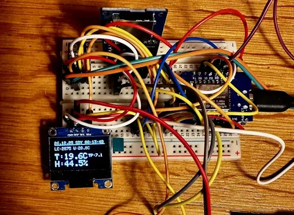

# ESP8266 Sensor Datalogger
A battery-friendly sensor monitoring system built on the **Wemos D1 Mini** (ESP8266) that logs temperature, humidity, and water temperature to an SD card with precise timestamps from a real-time clock.



> **Work in Progress** - This project is under active development. It runs stable for several days in most cases, but occasional log stopping issues may occur. Contributions and feedback are welcome!

---

## Why Was This Built?
I wanted a mostly accurate, expandable, low-power datalogger that I can take on multi-day camping trips. Commercial solutions are either too expensive, too limited in sensor options, or require proprietary software to access the data.

This project was designed with the following goals in mind:
- **Battery-friendly**: Must run for days on a single battery charge or power bank
- **Accurate timestamps**: Real-time clock ensures data is properly timestamped even without network connectivity
- **Expandable**: Easy to add different sensors (temperature, humidity, water temperature, and potentially more)
- **Simple data access**: Standard CSV format on a removable SD card - no special software needed
- **Offline operation**: WiFi is only used once for initial time sync, then the device is fully autonomous
- **Affordable**: Uses cheap, readily available components

The current configuration monitors ambient temperature/humidity and water temperature, which is useful for tracking weather conditions and water/beverage temperature during outdoor trips.

---

## Features

- **Dual Temperature Sensors**: SHT3x for ambient air (temperature + humidity) and DS18B20 for water/probe temperature
- **Precise Timekeeping**: DS3231 RTC with automatic NTP synchronization on first boot
- **Data Logging**: CSV format on SD card with UTC timestamps and millisecond precision
- **OLED Display**: 128x64 SSD1306 showing real-time measurements and historical data
- **Power Saving**: Light sleep mode between measurements, display auto-off after 20 seconds
- **Automatic Timezone**: Configured for CET/CEST (Central European Time with DST)
- **Button Control**: 
  - Short press: Wake display and show current readings
  - Long press (15s): Rotate log file (archive current, start fresh)
- **Robust SD Card Handling**: Automatic recovery and retry logic for SD card failures
- **Dewpoint Calculation**: Automatically calculated from temperature and humidity

---

## Hardware Requirements

| Component | Description | Typical Model |
|-----------|-------------|---------------|
| **Microcontroller** | Wemos D1 Mini | ESP8266-based |
| **Ambient Sensor** | Temperature & Humidity | SHT31 or SHT30 (I2C) |
| **Water Sensor** | Waterproof temperature probe | DS18B20 (OneWire) |
| **Real-Time Clock** | Battery-backed RTC | DS3231 module |
| **Display** | OLED 128x64 pixels | SSD1306 (I2C) |
| **Storage** | MicroSD card module | SPI interface |
| **Button** | Momentary push button | Any normally-open |
| **Power** | 5V USB or battery | - |

### Optional
- 4.7k ohm resistor (pull-up for DS18B20 data line)
- CR2032 battery for DS3231 RTC backup

---

## Wiring Diagram

### Pin Connections

```
Wemos D1 Mini          Component              Notes
-------------------------------------------------------------
D1 (GPIO5)  -------->  SDA (I2C bus)          SHT3x, DS3231, SSD1306
D2 (GPIO4)  -------->  SCL (I2C bus)          SHT3x, DS3231, SSD1306
D3 (GPIO0)  -------->  Button                 Connect to GND when pressed
D4 (GPIO2)  -------->  DS18B20 Data           4.7k pull-up to 3.3V
D5 (GPIO14) -------->  SD Card CLK (SCK)      SPI Clock
D6 (GPIO12) -------->  SD Card MISO           SPI Data Out
D7 (GPIO13) -------->  SD Card MOSI           SPI Data In
D8 (GPIO15) -------->  SD Card CS             Chip Select
RX (GPIO3)  -------->  DS3231 SQW/INT         RTC interrupt for wake
3V3         -------->  VCC (all sensors)      3.3V power rail
GND         -------->  GND (all sensors)      Common ground
```

### I2C Bus (directly to module pins)

| Module | SDA | SCL | VCC | GND | Address |
|--------|-----|-----|-----|-----|---------|
| SHT3x | D1 | D2 | 3V3 | GND | 0x44 or 0x45 |
| DS3231 | D1 | D2 | 3V3 | GND | 0x68 |
| SSD1306 | D1 | D2 | 3V3 | GND | 0x3C |

### Visual Wiring

```
                    +------------------+
                    |   Wemos D1 Mini  |
                    |                  |
    Button -------->| D3           3V3 |<---- VCC (all modules)
   DS18B20 -------->| D4           GND |<---- GND (all modules)
   SD CLK  <--------| D5            D1 |<---> SDA (I2C bus)
   SD MISO <--------| D6            D2 |<---> SCL (I2C bus)
   SD MOSI -------->| D7            RX |<---- DS3231 SQW (optional)
   SD CS   <--------| D8               |
                    +------------------+
```

---

## Data Format

Data is logged to `/data.csv` on the SD card in the following format:

```csv
ts_utc,epoch_ms,timestamp_local,temperature_C,humidity_pct,dewpoint_C,water_temp_C,sht_ok,water_ok
2024-12-25T14:30:00Z,1735137000000,2024-12-25 15:30:00,22.45,58.3,13.72,8.50,1,1
```

| Column | Description |
|--------|-------------|
| `ts_utc` | ISO8601 UTC timestamp |
| `epoch_ms` | Unix timestamp in milliseconds |
| `timestamp_local` | Local time (CET/CEST) |
| `temperature_C` | Air temperature in degrees C |
| `humidity_pct` | Relative humidity in % |
| `dewpoint_C` | Calculated dewpoint in degrees C |
| `water_temp_C` | Water/probe temperature in degrees C |
| `sht_ok` | SHT3x sensor status (1=OK, 0=Error) |
| `water_ok` | DS18B20 sensor status (1=OK, 0=Error) |

---

## Getting Started

### 1. Install Arduino IDE Libraries

Install the following libraries via Arduino Library Manager:

- `Adafruit SHT31 Library`
- `Adafruit SSD1306`
- `Adafruit GFX Library`
- `RTClib` (by Adafruit)
- `DallasTemperature`
- `OneWire`
- `SD` (built-in)

### 2. Configure WiFi (First Boot Only)

Edit the WiFi credentials in the code for initial NTP time sync:

```cpp
#define WIFI_SSID "your_wifi_ssid"
#define WIFI_PASS "your_wifi_password"
```

**Note**: WiFi is only used once during first boot to sync the RTC Module. After that, the device operates fully offline.

### 3. Upload and Run

1. Connect your Wemos D1 Mini via USB
2. Select **Board**: "LOLIN(WEMOS) D1 R2 & mini"
3. Select the correct **Port**
4. Upload the sketch
5. Open Serial Monitor (115200 baud) to observe boot sequence

### 4. Insert SD Card

- Format the SD card as FAT32
- The device will automatically create `data.csv` on first run

---

## Usage

### Display Modes

The display cycles through two views (10 updates each, ~20 seconds total):

1. **Current Data**: Live readings with log count and water temperature
2. **Historical Data**: Last 3 measurements from the CSV file

### Button Functions

| Action | Duration | Result |
|--------|----------|--------|
| Short press | < 15s | Wake display, show fresh measurements |
| Long press | > 20s | Rotate log file (archive current CSV) |

### Measurement Intervals

| Mode | Interval | Description |
|------|----------|-------------|
| With SD card | 4 minutes | Full logging mode |
| Without SD card | 1 minute | Monitoring only (no logging) |

---

## Sleep Mode and Power Management

This section explains in detail how the ESP8266 light sleep mode is implemented and why the configuration choices were made.

### Why Light Sleep Instead of Deep Sleep?

The ESP8266 offers two main power-saving modes: **deep sleep** and **light sleep**. This project uses **light sleep** for the following reasons:

1. **RAM Preservation**: Light sleep retains all variables in RAM. Deep sleep erases RAM completely, requiring a full reboot on wake. This would mean re-initializing the SD card, sensors, and display on every measurement cycle, which takes several seconds and increases wear.

2. **Faster Wake Time**: Light sleep wakes in microseconds. Deep sleep requires a full boot sequence (500ms+), which would add significant delays and increase power consumption during the wake transition.

3. **GPIO State Retention**: Light sleep maintains GPIO pin states. The SD card chip select (CS) line stays in its configured state, preventing spurious card accesses during sleep.

4. **Peripheral Continuity**: I2C and SPI buses remain configured. The DS3231 RTC can trigger interrupts without reconfiguration.

### Sleep Duration Calculation

The sleep duration is calculated dynamically based on the time elapsed since the last measurement:

```
remaining_sleep = measurement_interval - time_since_last_measurement
```

Key constraints:
- **Maximum sleep duration**: 268 seconds (ESP8266 hardware limit for `wifi_fpm_do_sleep`)
- **Minimum sleep duration**: 1 second (to prevent busy-looping)
- **Sliced sleep**: Sleep is performed in 5-second slices to allow responsive button wake detection

### SD Card Shutdown During Sleep

The SD card is conditionally shut down before sleep to save power and prevent file system corruption:

| Sleep Duration | SD Card State | Reason |
|----------------|---------------|--------|
| > 30 seconds | Shut down | Power savings outweigh re-init time |
| <= 30 seconds | Kept active | Faster wake, minimal power benefit from shutdown |

When shut down, the SD card module is properly deinitialized:
1. `SD.end()` is called to close any open files
2. The CS pin is set HIGH (deselected)
3. SPI bus is terminated

On wake, `reinitSD()` reinitializes the card with multiple retry attempts.

### Wake Sources

The device can wake from light sleep via two sources:

1. **Button Press (GPIO0 / D3)**: User presses the button to view current readings. Triggers display activation and a fresh sensor measurement.

2. **RTC Interrupt (GPIO3 / RX)**: The DS3231 SQW/INT pin can wake the device for scheduled measurements. This is optional and used for very long sleep periods (> 250 seconds). (this has to be tested more)

3. **Timer Expiry**: If neither wake source triggers, the sleep timer expires and the device wakes automatically.

### Wake Source Detection

After waking, the firmware checks which source triggered the wake:

```
Button pressed (D3 LOW)  -->  Display mode: show readings, no logging
RTC alarm (RX LOW)       -->  Measurement mode: read sensors, log to SD
Timer expired            -->  Measurement mode: read sensors, log to SD
```

### Sleep Loop Implementation

The sleep is implemented as a loop of short sleep periods rather than one long sleep:

```cpp
while (remaining > 0) {
    // Check for button press before each sleep slice
    if (button_pressed) break;
    
    // Sleep for 5 seconds (or remaining time if less)
    wifi_fpm_do_sleep(slice * 1000000);
    
    // After SDK sleep returns, wait the actual time
    delay(slice * 1000);
    remaining -= slice;
}
```

This approach ensures:
- Button presses are detected within 5 seconds maximum
- The sleep can be interrupted cleanly at slice boundaries
- Millis() timer continues to advance (unlike deep sleep)

### Power Consumption Estimates

| State | Typical Current | Notes |
|-------|-----------------|-------|
| Active (measuring) | ~70-80 mA | WiFi off, sensors active |
| Display on | ~25-30 mA | OLED drawing current |
| Light sleep | ~1-3 mA | All peripherals idle |
| Light sleep (SD shutdown) | ~0.5-1 mA | SD card power eliminated |

Note: Actual power consumption depends heavily on the specific modules used. Some SD card modules have always-on voltage regulators that consume 2-5 mA even when idle.

### Configuration Constants

The following constants control sleep behavior:

| Constant | Value | Description |
|----------|-------|-------------|
| `INTERVAL_SD` | 240 seconds | Measurement interval with SD card |
| `INTERVAL_NO_SD` | 60 seconds | Measurement interval without SD card |
| `MAX_SLEEP_SEC` | 268 seconds | Maximum single sleep duration |
| `LONG_PRESS_MS` | 15000 ms | Duration for long button press detection |
| `DISPLAY_UPDATE_INTERVAL` | 1000 ms | Display refresh rate when active |

### Why These Specific Intervals?

- **4 minutes (with SD)**: Balances data resolution with power consumption and SD card write wear. Environmental conditions rarely change faster than this for most monitoring applications.

- **1 minute (without SD)**: When no logging occurs, more frequent measurements provide better real-time monitoring without the SD card wear concern.

- **268 second maximum**: This is the ESP8266 SDK limit for the light sleep timer. Longer sleeps would require RTC-based wake scheduling.

### Example Serial Log

The following log shows a typical operation cycle: button wake, display activation, timer wake, measurement, and sleep:

```
23:59:11.161 -> [WAKE] Button wake
23:59:11.161 -> [WAKE] Reinitializing SD...
23:59:11.161 -> [SD] Attempting SD card initialization...
23:59:11.485 -> [SD] Card type: SDHC
23:59:11.485 -> [SD] Existing data.csv verified (235836 bytes)
23:59:11.531 -> [SD] SD card initialized successfully
23:59:14.877 -> [SD] Read 3 historical measurements
23:59:14.877 -> [DISPLAY] ON - Data refreshed
23:59:14.877 -> [BUTTON] Display measurement
23:59:14.877 -> [BUTTON] SHT3x: T=19.62°C H=44.7%
23:59:14.923 -> [BUTTON] DS18B20 async: 12-bit, 750ms
23:59:16.037 -> [SENSOR] DS18B20 async done: 20.44°C
23:59:33.956 -> [DISPLAY] OFF
23:59:33.956 -> [SD] Forcing SD card shutdown...
23:59:34.050 -> [SD] SD card shutdown complete
23:59:34.050 -> [SLEEP] Light sleep: 186s, wake=GPIO0(btn), RTC=disabled, SD=shutdown
00:02:40.422 -> [WAKE] Timer wake
00:02:40.422 -> [WAKE] Reinitializing SD card...
00:02:40.422 -> [SD] Attempting SD card initialization...
00:02:40.746 -> [SD] Card type: SDHC
00:02:40.746 -> [SD] Existing data.csv verified (235836 bytes)
00:02:40.746 -> [SD] SD card initialized successfully
00:02:40.793 -> [SENSOR] SHT3x: T=19.28°C H=44.9% TD=7.01°C
00:02:40.839 -> [SENSOR] DS18B20: 20.44°C
00:02:41.117 -> [LOG] Data committed: 82 bytes (expected LC=2873)
00:02:42.738 -> [VERIFY] Write verified, LC=2873 (file: 235918 bytes)
00:02:42.738 -> [SD] Forcing SD card shutdown...
00:02:42.830 -> [SD] SD card shutdown complete
00:02:42.830 -> [SLEEP] Light sleep: 238s, wake=GPIO0(btn), RTC=disabled, SD=shutdown
```

This shows:
1. Button wake triggers SD reinit and display activation
2. Sensors are read asynchronously (DS18B20 takes 750ms for 12-bit resolution)
3. Display auto-off after ~20 seconds
4. Timer wake triggers a full measurement cycle with SD logging
5. Write verification confirms data was saved (file grew from 235836 to 235918 bytes)
6. SD card shutdown and return to sleep

---

- **Work in progress** - May require occasional restarts
- **SD card dependent** - Some SD cards may cause issues; try different brands
- **WiFi required for initial setup** - First boot needs network for NTP sync
- **Build time fallback** - If NTP fails, RTC is set to compile time (local, not UTC)
- **No web interface** - Data must be retrieved by removing the SD card

---

## Project Structure

```
templogger/
├── datalogger.ino    # Main Arduino sketch
└── README.md         # This file
```

---

## Troubleshooting

| Issue | Solution |
|-------|----------|
| Display shows "NO1" | SD card not detected - check wiring and format |
| SHT3x ERROR | I2C sensor not found - check wiring and address |
| W:ERROR | DS18B20 not detected - check wiring and pull-up resistor |
| Time is wrong | Delete EEPROM magic byte or re-flash to trigger NTP sync |
| SD card errors | Try a different SD card, ensure FAT32 format |

---

## License

This project is open source. Feel free to use, modify, and distribute.

---

## Contributing

Contributions are welcome! This project is still in active development. Please open issues for bugs or feature requests.

---

Made with ❤️ in Bavaria from a Bavarian 🏔️

If you find this useful and want to support:
**Bitcoin (BTC):** `bc1q3lz8vxpk0rchqn6dq8g08rkcqts425csuvnjr2477uzdenak5n8sfds2ke`